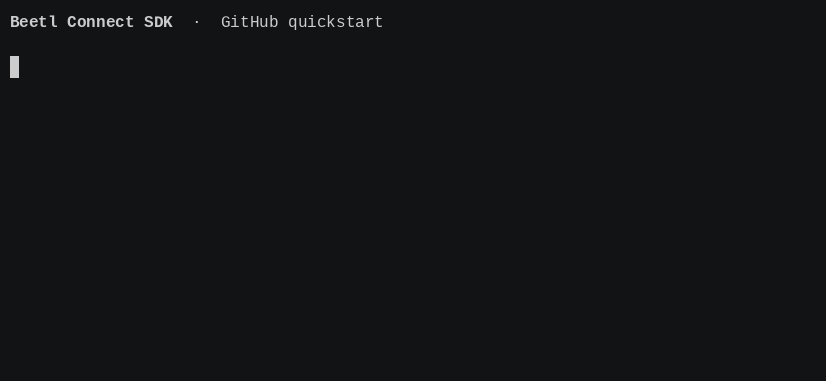

<p align="center"></p>

# Beetl Connect SDK

[](https://www.npmjs.com/package/@beetlio/connect)
[](https://github.com/beetlio/connect/actions/workflows/ci.yml)
[](package.json)
[](LICENSE)

A TypeScript library for authoring API integrations for the Beetl data processing
platform. Connect handles authentication, retries, and validation for:

- **[Pull syncs](https://beetlio.github.io/connect/#records):** read records from an API,
  with pagination, resumable checkpoints, and local CLI execution.
- **[Destinations](https://beetlio.github.io/connect/#destinations):** write record batches
  and optional deletions to an API through the embedded host API.

An integration can define either or both, sharing the same connection and authentication.

**[Documentation](https://beetlio.github.io/connect/)** · [Examples](examples) · [Architecture](ARCHITECTURE.md) · [Contributing](CONTRIBUTING.md)



## Get started

This quickstart reads one public GitHub user with a pull sync. Requires **Node.js 24.2+**.
In a new directory, create `package.json`:

```json
{
  "name": "my-integration",
  "version": "0.0.0",
  "private": true,
  "type": "module",
  "files": ["integration.ts"]
}
```

Install the SDK:

```sh
npm install --save-dev @beetlio/connect
```

Create `integration.ts`:

```ts
import { defineIntegration, z } from "@beetlio/connect";

const User = z.object({ id: z.number(), login: z.string() });

export default defineIntegration({
  key: "github",
  displayName: "GitHub",
  connection: { origin: "https://api.github.com" },
  syncs: (sync) => ({
    users: sync({
      mode: "replace",
      records: User,
      async *run(ctx) {
        const user = await ctx.json("/users/octocat", User);

        yield { records: [user] };
      },
    }),
  }),
});
```

Configure the integration, then run it:

```sh
npx beetl-connect configure . users
npx beetl-connect sync . users --output users.ndjson
```

`users.ndjson` contains one validated GitHub user record. Continue with the
[user guide](https://beetlio.github.io/connect/) for authentication, pagination,
checkpoints, and packaging for Beetl.

## Development

```sh
npm ci
npm run check
npm test
```

See [CONTRIBUTING.md](CONTRIBUTING.md) for development commands and
[AGENTS.md](AGENTS.md) for coding harness instructions.

[Apache-2.0](LICENSE) · [Security policy](SECURITY.md)
